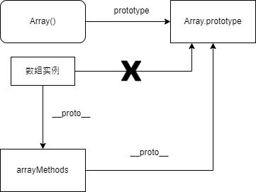

# Vue2数组响应式
```js
/*
 * not type checking this file because flow doesn't play well with
 * dynamically accessing methods on Array prototype
 */

import { TriggerOpTypes } from '../../v3'
import { def } from '../util/index'

const arrayProto = Array.prototype
export const arrayMethods = Object.create(arrayProto)

const methodsToPatch = [
  'push',
  'pop',
  'shift',
  'unshift',
  'splice',
  'sort',
  'reverse'
]

/**
 * Intercept mutating methods and emit events
 */
methodsToPatch.forEach(function (method) {
  // cache original method
  const original = arrayProto[method]
  def(arrayMethods, method, function mutator(...args) {
    const result = original.apply(this, args)
    const ob = this.__ob__
    let inserted
    switch (method) {
      case 'push':
      case 'unshift':
        inserted = args
        break
      case 'splice':
        inserted = args.slice(2)
        break
    }
    if (inserted) ob.observeArray(inserted)
    // notify change
    if (__DEV__) {
      ob.dep.notify({
        type: TriggerOpTypes.ARRAY_MUTATION,
        target: this,
        key: method
      })
    } else {
      ob.dep.notify()
    }
    return result
  })
})
```
我们可以看到在这里，新建了一个arrayMethods对象，这个对象指向我们的Array.prototype，然后我们再在这个对象上面定义这七个方法，主要是调用了原来的方法，然后通知所有的依赖，返回相应的结果。这就出来了一个问题，那我们实例对象是怎么跟这个新建的对象联系在一起呢，这个答案出现在我们的这个Observer的index.js里面
```js
export class Observer {
  dep: Dep
  vmCount: number // number of vms that have this object as root $data

  constructor(public value: any, public shallow = false, public mock = false) {
    // this.value = value
    this.dep = mock ? mockDep : new Dep()
    this.vmCount = 0
    def(value, '__ob__', this)
    if (isArray(value)) {
      if (!mock) {
        if (hasProto) {
          /* eslint-disable no-proto */
          ;(value as any).__proto__ = arrayMethods
          /* eslint-enable no-proto */
        } else {
          for (let i = 0, l = arrayKeys.length; i < l; i++) {
            const key = arrayKeys[i]
            def(value, key, arrayMethods[key])
          }
        }
      }
      if (!shallow) {
        this.observeArray(value)
      }
    } else {
      /**
       * Walk through all properties and convert them into
       * getter/setters. This method should only be called when
       * value type is Object.
       */
      const keys = Object.keys(value)
      for (let i = 0; i < keys.length; i++) {
        const key = keys[i]
        defineReactive(value, key, NO_INIITIAL_VALUE, undefined, shallow, mock)
      }
    }
  }

  /**
   * Observe a list of Array items.
   */
  observeArray(value: any[]) {
    for (let i = 0, l = value.length; i < l; i++) {
      observe(value[i], false, this.mock)
    }
  }
}
```
我们的这个对象如果是Array的话，就会将他的隐式原型指向我们的这个新建的arrayMethods对象，然后这样我们调用相应的方法的时候，就会先调用到这个对象上面的方法，从而实现了劫持！
他们的整个关系是这样子的：
 